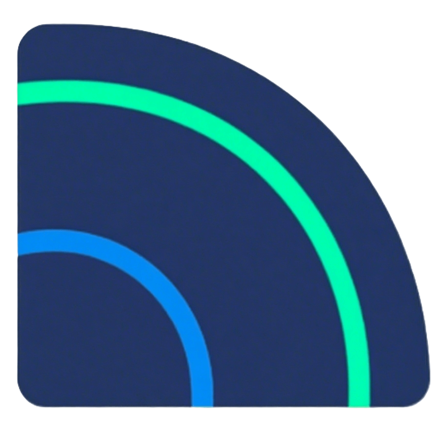

# 

<h1 align="center">focus-develop <专注开发></h1>

  
  

English | <a href="README.md">中文</a>

Focus-Develop
It is a collection of open-source projects covering multiple languages and scenarios, aiming to provide developers with
an "out-of-the-box" project framework and tools, helping users skip the cumbersome basic construction stage and quickly
enter the core business logic development. Its core design concept is minimalism and modularization. Through a layered
architecture, standardized protocols, and flexible expansion mechanisms, it is compatible with mainstream development
scenarios such as the cloud, mobile terminals, and microservices, while also being compatible with multiple programming
languages and toolchains.

***"Focus-Develop It is not only a collection of tools, but also the practice of the development concept - to bring
technology back to the essence of business."***

## ✨ Core characteristics

- **Multi-technology stack integration** : Covering the mainstream technology frameworks of both the front-end and
  back-end
- **Standardized Architecture** : Unify the project structure norms and best practices
- **Modular design** : Combine functional modules as needed to avoid redundant code
- **Zero-configuration startup** : Built-in basic dependencies and toolchain, ready to use out of the box
- **Cloud-native support** : Natively adapted to containerized deployment and microservice architecture

## 🧩 List of integrated frameworks

The following table lists the currently implemented framework systems, which are continuously expanding:

| Framework Module            | Core Features                                                              | Applicable Scenarios                                                    |
|-----------------------------|----------------------------------------------------------------------------|-------------------------------------------------------------------------|
| **nuxt3-vue3-ts**           | SSR/SSG support, automatic API routing, strong type checking               | High-performance SEO-friendly Web application                           |
| **springboot-ddd**          | Domain-driven Design, Event Traceability, Hexagonal Architecture           | Complex Business System/Domain Model Project                            |
| **springboot-ssm**          | Annotated CRUD, multi-data source support, lightweight transaction control | Traditional enterprise-level background management system/Basic project |
| **spring-cloud-alibaba**    | Implemented based on spring-cloud-alibaba-dependencies                     | Out-of-the-box/microservice cluster                                     |
| **spring-cloud-kubernetes** | Best Practices of Microservices and Cloud-native                           | Kubernetes Strongly Associated Platform                                 |

> 💡 Framework continuous expansion plan: uni-app+uView, Next.js+React, etc.

## 🤝 Join the community

**Recommended contribution path**：

1. Submit an Issue to report problems or suggestions
2. Claim the development task
3. Submit PR (in accordance with [Git specifications])
4. Become a core maintainer 🔥
