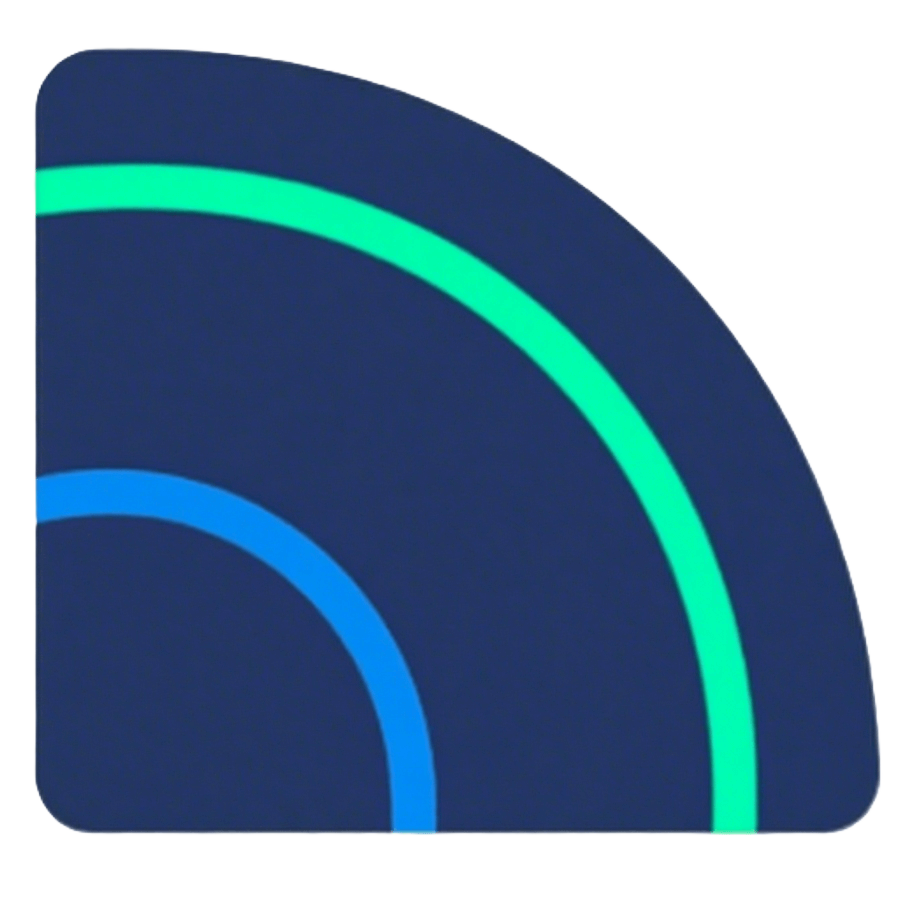

# 

<h1 align="center">focus-develop <专注开发></h1>

  
  

<a href="README-en.md">English</a> | 中文

Focus-Develop
是一套多语言、多场景覆盖的开源项目集合，旨在为开发者提供“开箱即用”的项目框架与工具，帮助用户跳过繁琐的基础搭建环节，快速进入核心业务逻辑开发。其核心设计理念是​​极简主义​​与​​模块化​​，通过分层架构、标准化协议和灵活的扩展机制，适配云端、移动端、微服务等主流开发场景，同时兼容多种编程语言和工具链。

***"Focus-Develop 不仅是工具集合，更是开发理念的实践——让技术回归业务本质。"***

## ✨ 核心特性

- **多技术栈整合**：覆盖前后端主流技术框架
- **标准化架构**：统一项目结构规范与最佳实践
- **模块化设计**：按需组合功能模块，避免冗余代码
- **零配置启动**：内置基础依赖与工具链，开箱即用
- **云原生支持**：原生适配容器化部署与微服务架构

## 🧩 集成框架清单

下表列出当前已实现的框架体系，持续扩展中：

| 框架模块                 | 核心特性                      | 适用场景             |
|----------------------|---------------------------|------------------|
| **nuxt3-vue3-ts**    | SSR/SSG支持, 自动API路由, 强类型校验 | 高性能SEO友好型Web应用   |
| **springboot-ddd**   | 领域驱动设计, 事件溯源, 六边形架构       | 复杂业务系统/领域模型项目    |
| **springboot-ssm**   | 注解式CRUD, 多数据源支持, 轻量级事务控制  | 传统企业级后台管理系统/基础项目 |
| **springcloud-saas** | 多租户隔离, 服务网格, 分布式配置中心      | SaaS云平台/微服务集群    |

> 💡 框架持续扩展计划：uni-app+uView 、Next.js+React等等

## 🤝 加入社区

**推荐贡献路径**：

1. 提交 Issue 报告问题或建议
2. 认领开发任务
3. 提交 PR（遵循 [Git 规范]）
4. 成为核心维护者 🔥
