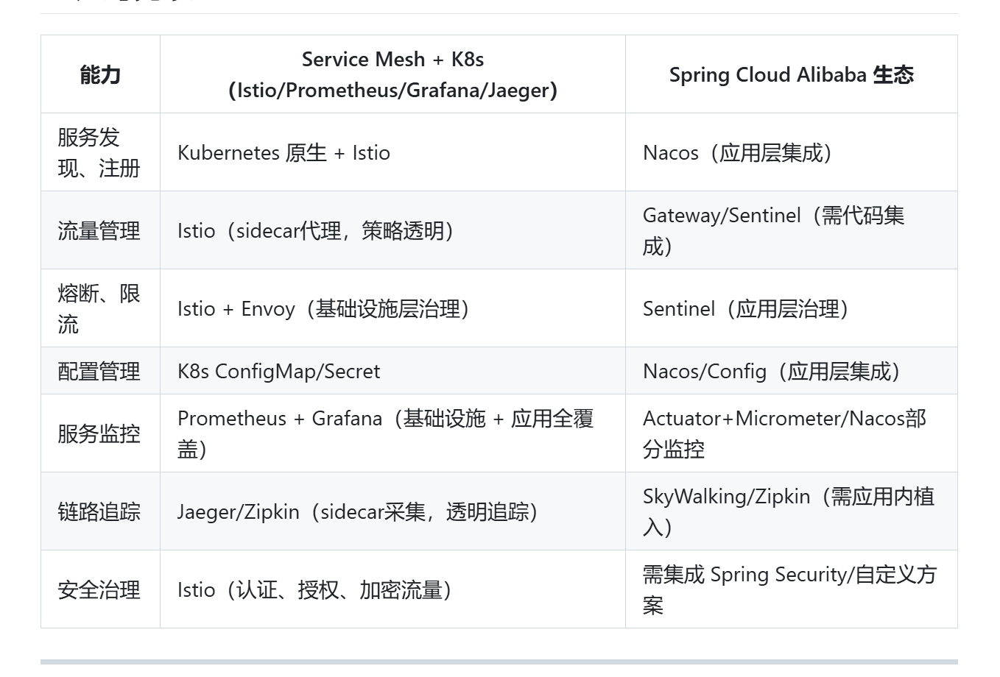

## spring-cloud-kubernetes 微服务与云原生实践
> Spring Cloud Kubernetes + Service Mesh
## 一、组件介绍与 Spring Cloud Alibaba 对比

1. Istio
   - 作用：Istio 是主流的 Service Mesh（服务网格）实现，负责微服务间的流量管理、安全策略、服务发现、负载均衡、故障注入、流量分流、熔断、限流等服务治理功能。
   - 工作方式：通过 Sidecar（一般是 Envoy）代理拦截进出服务的所有流量，治理能力从应用层剥离到基础设施层。
   - Spring Cloud Alibaba 对应：主要由 Sentinel（限流熔断）、Nacos（服务发现）、Spring Cloud Gateway（网关）等实现类似的部分能力，但这些功能通常需应用代码集成，非透明治理
2. Prometheus
   - 作用：开源的监控和指标采集系统，负责自动搜集 K8s 集群和应用的各项指标（如 CPU、内存、请求量、延迟等）。
   - Spring Cloud Alibaba 对应：Spring Boot Actuator + Micrometer 可做应用层指标采集，Nacos/Sentinel 提供部分监控；但基础设施监控还是靠 Prometheus 更完善。
3. Grafana
   - 作用：开源的可视化平台，支持多种数据源（Prometheus、Elasticsearch等），通过仪表盘展示监控数据和业务指标。
   - Spring Cloud Alibaba 对应：Spring Cloud Alibaba 没有自带可视化平台，通常结合第三方（如 Grafana、阿里云 ARMS）。
4. Jaeger
   - 作用：分布式链路追踪系统，追踪微服务请求在各服务间的调用路径、性能瓶颈、延迟分析等。
   - Spring Cloud Alibaba 对应：可用 SkyWalking、Zipkin 等做链路追踪，部分公司用阿里云 ARMS Trace。
## 二、对比表

